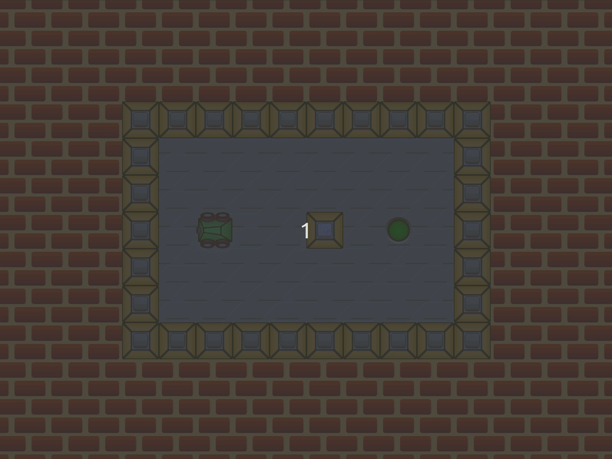
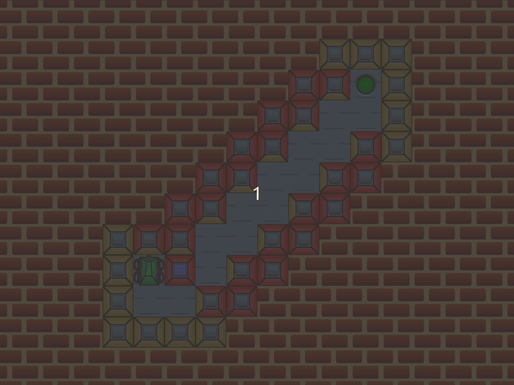
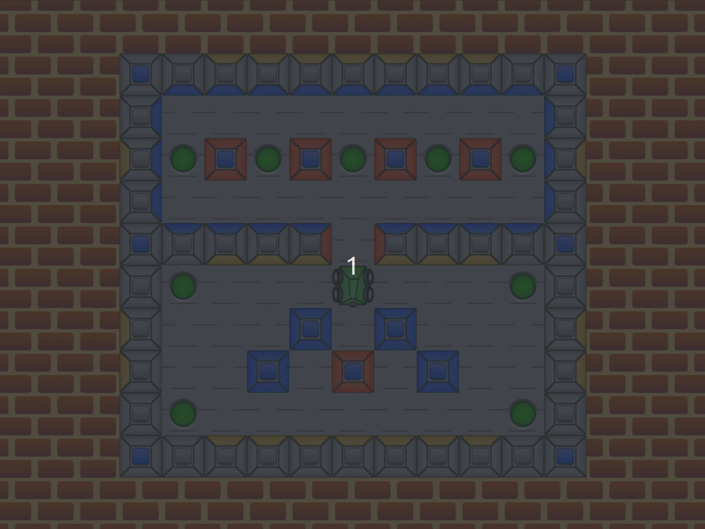
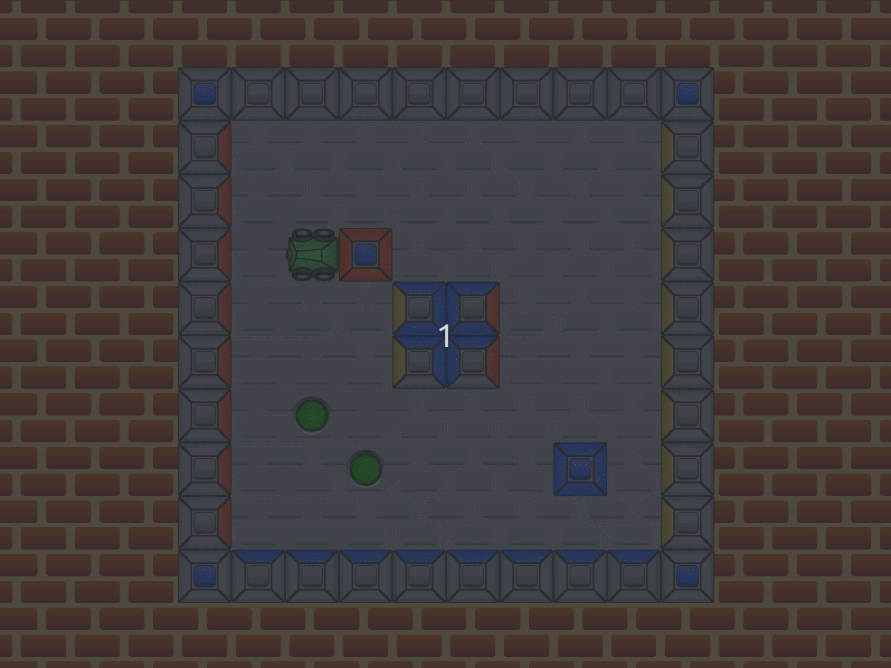
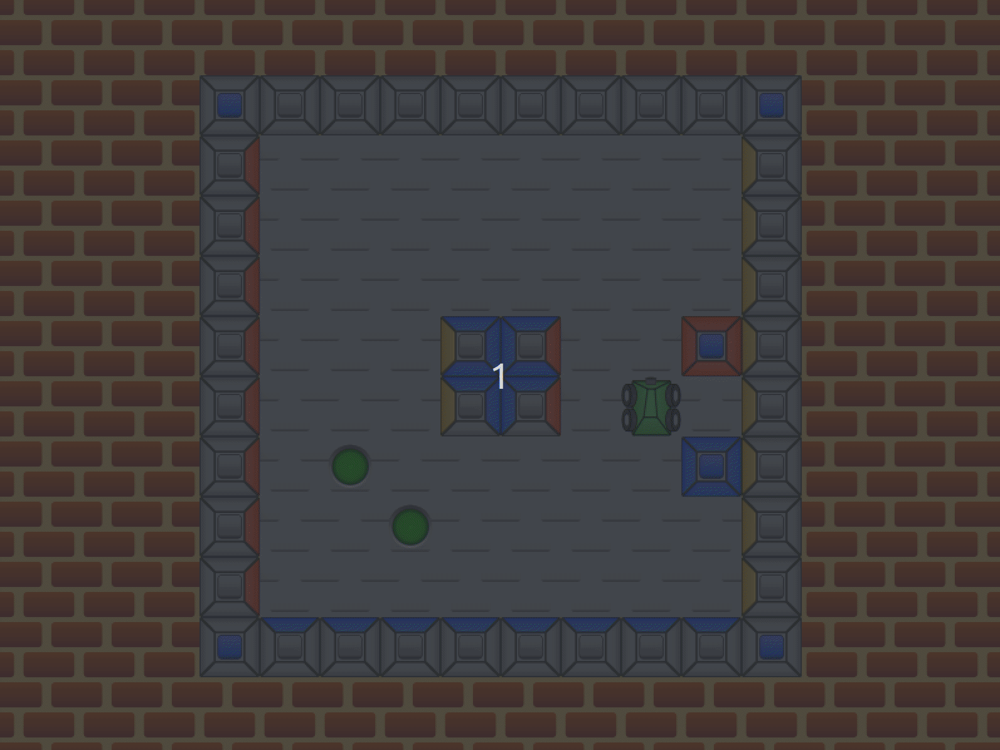
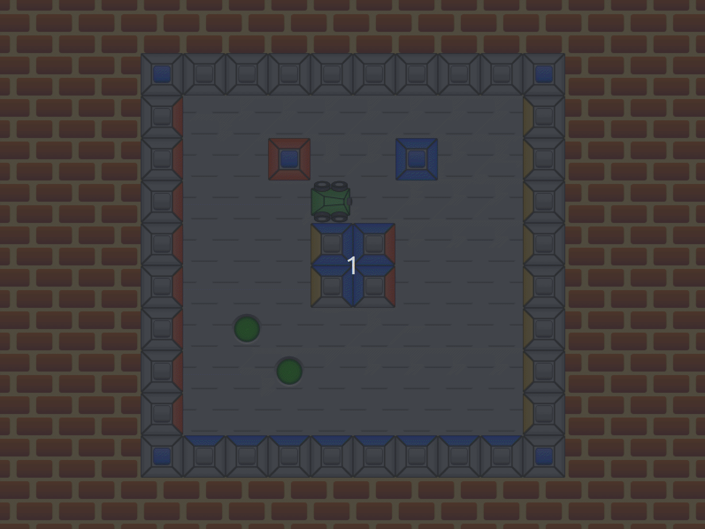
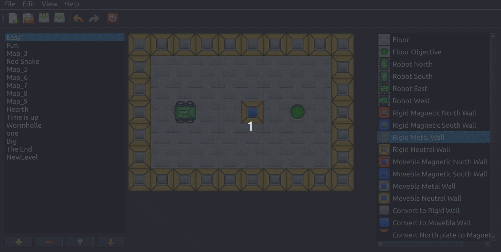

# About Magnetic Sokoban

This game was an exercise developed for the discipline Computing III. The goal is to help a small robot pull boxes to their correct destinations. The challenge is that box faces may be positively or negatively charged. Such charges may cause boxes and wall to attract or repel to each other.

The original project was developed using Qt4 and C++, and is mostly the same. Recent updates were performed to port it to Qt6 and check compatibility with current platforms (Ubuntu 22.04). The project contains three main modules: (1) a shared project with the maps data; (2) a level editor; and (3) the game. You can execute the Level Editor and the Game. The shared project is simply a library with common classes.

# Starting the Game

As of now, this game is not deployed anywhere. To execute it you will need to install QtCreator, open the project in the src folder, build it, and execute the Game project.

# Game Rules

On a base level, it works just like a normal Sokoban game. You can use the arrow keys to move the robot around and pull the boxes.

A wall/box face colored in red or blue will indicate that the face is charged positively or negatively, respectively. If you connect two faces with the same colors they will try to repel each other.

Some puzzle will require this property to be solved.

Similarly, if you connect two faces with different colors they will connect to each other and you won't be able to move them anymore.

A yellow face will not interact with any other face.

A gray face is made of metal. It will lock both red and blue faces.

# Level Editor

If you want to create your own levels or edit the existing ones, you can execute the Level Editor and open the file in src/Sokoban/mapPack1.mpk.

